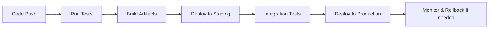

# Deployment Strategy

## Overview

The system uses modern CI/CD practices for reliable, automated deployments across all components.

## Mobile App Deployment

- **Android**: Google Play Store
  - Build with Fastlane or Expo Application Services
  - Automated beta releases via Play Store Beta
- **iOS**: Apple App Store
  - Build with Fastlane
  - TestFlight for beta testing
- **CI/CD**: GitHub Actions or Bitrise
  - Automated builds on push to main branch
  - Code signing and keystore management
  - Version bumping and changelog generation

## Backend Deployment

- **Platform**: AWS, Google Cloud, or DigitalOcean
- **Containerization**: Docker
- **Orchestration**: Docker Compose for simple, Kubernetes for scale
- **CI/CD**: GitHub Actions
  - Build Docker image
  - Run tests
  - Deploy to staging/production
  - Database migrations
- **Environment**: Staging and production environments
- **Monitoring**: Application logs, health checks

## Admin Panel Deployment

- **Hosting**: Vercel, Netlify, or AWS S3 + CloudFront
- **CI/CD**: Automated deployment on push
- **Build**: Static site generation if needed

## Database

- **Hosting**: Managed service (AWS RDS, Google Cloud SQL)
- **Backup**: Automated daily backups
- **Migration**: Flyway or Liquibase for schema changes

## CI/CD Pipeline Overview

## Environment Management

- **Config**: Environment variables for secrets
- **Secrets**: Managed via CI/CD platform
- **Versioning**: Semantic versioning for releases

## Monitoring & Rollback

- **Logging**: Centralized logging (ELK stack or CloudWatch)
- **Metrics**: Application performance monitoring
- **Alerts**: Email/SMS for failures
- **Rollback**: Automated rollback scripts

## Security

- **SSL/TLS**: HTTPS everywhere
- **Secrets**: No hardcoded secrets
- **Vulnerability Scanning**: Automated scans in CI

## Cost Optimization

- **Auto-scaling**: For backend based on load
- **CDN**: For static assets
- **Caching**: Database query caching
