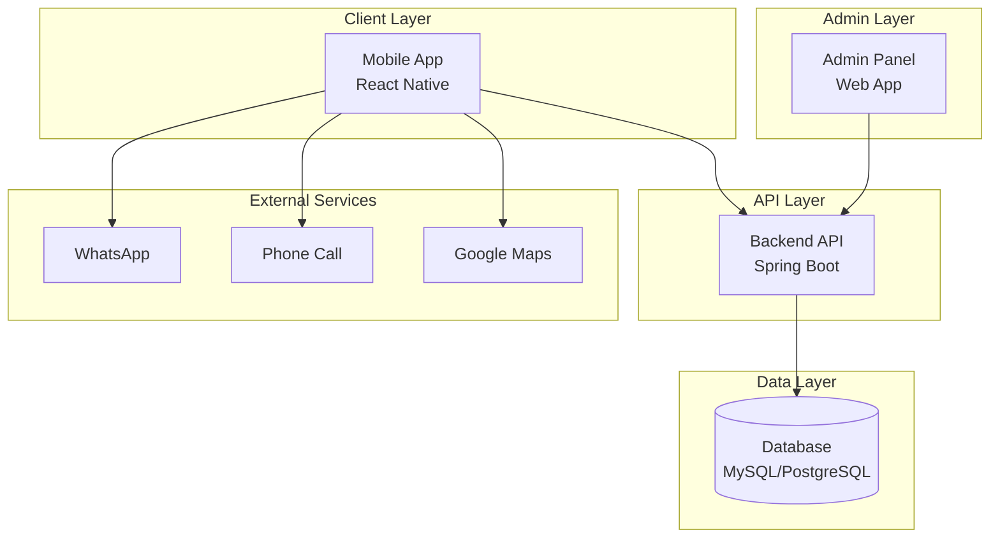

# System Architecture

## Overview

The system is designed as a scalable, configuration-driven mobile application for a hardware shop, with a backend for content management and an admin panel for operations. The architecture follows industry best practices, emphasizing modularity, security, and performance.

## High-Level Architecture

## Mobile App Architecture

- **Framework**: React Native with TypeScript
- **Architecture**: Feature-based Clean Architecture
  - Presentation Layer: Screens, Components
  - Domain Layer: Business Logic, Use Cases
  - Data Layer: Repositories, API Clients
- **State Management**: Redux Toolkit
- **Navigation**: React Navigation
- **Networking**: Axios with interceptors
- **Caching**: MMKV for performance
- **Localization**: react-i18next

## Backend Architecture

- **Framework**: Spring Boot (Java)
- **Architecture**: Layered Architecture
  - Controller Layer: REST APIs
  - Service Layer: Business Logic
  - Repository Layer: Data Access
- **Security**: JWT for admin APIs
- **Validation**: Bean Validation
- **Logging**: SLF4J with structured logs

## Database Design

- Relational database with proper normalization
- Indexing for performance
- No static data; all configurable

## Admin Panel

- Web application for content management
- Role-based access control
- CRUD operations for all entities

## Security Considerations

- Input validation on all layers
- Rate limiting for public APIs
- Secure admin authentication
- No sensitive data on mobile device

## Scalability

- Stateless backend
- Database read replicas if needed
- CDN for images
- Horizontal scaling for backend

## Deployment

- Mobile: CI/CD with Expo or Fastlane
- Backend: Docker containers on cloud
- Admin: Static hosting or server-side rendering
